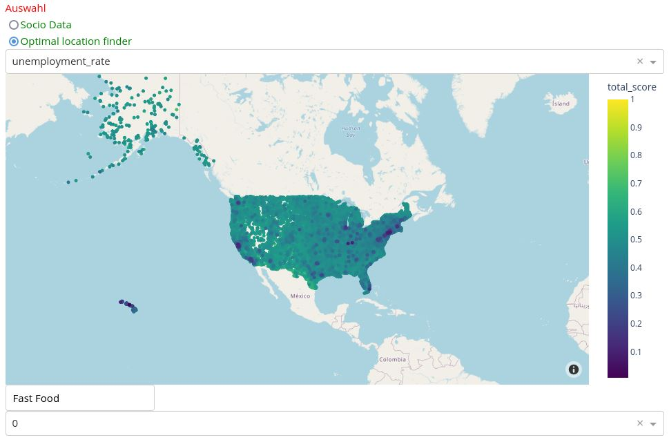
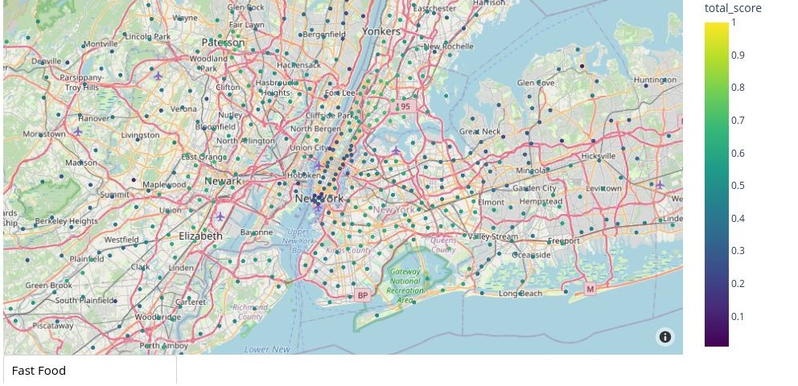
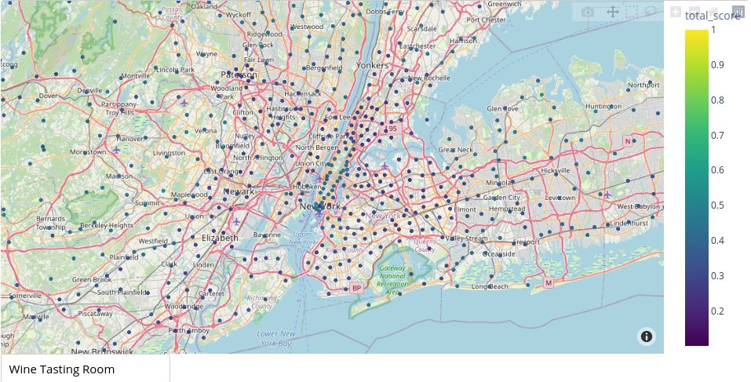
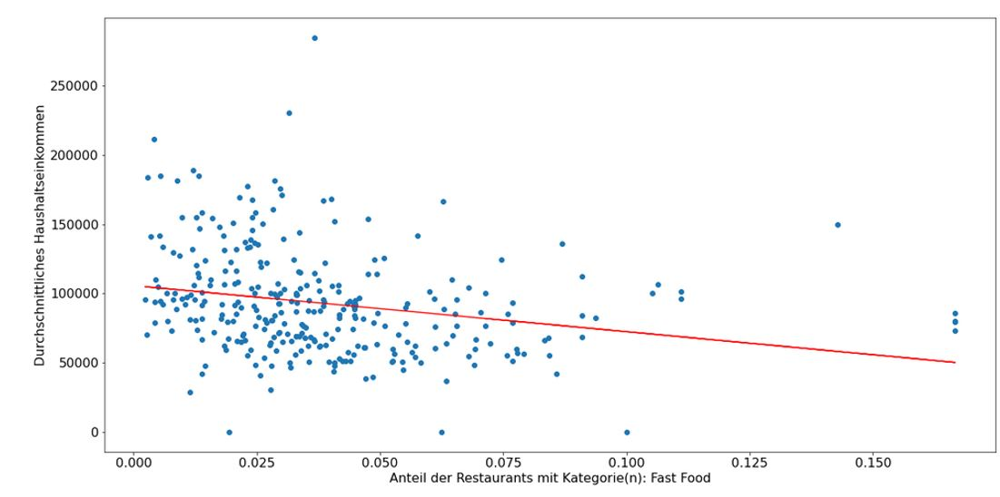

#  Data Science Projekt Synchronisationsmodul Informatik

Lukas Scharfe, Kevin Schmiedlin, Patrick Eidemüller

### Ziel des Projekts

In unserer neuen Rolle als Data Scientist bei einem größeren Betrieber von Restaurants und Bars in den USA haben wir von unserer Vorgesetzten den Auftrag bekommen nach Zusammenhängen zwischen dem Wetter und Restaurant Bewertungen und Besuchen zu finden. 

Durch diese Analyse sollten im Bestfall Entscheidungen zum öffnen neuer Fillialen abgeleitet werden. 

### Einrichtung

Zu Beginn haben wir uns user mit Passwort und eine Ordner Struktur auf dem Server eingerichtet. Danach haben wir python, PostgreSQL und die erforderlichen packages installiert. 

#### Vorauswahl der benötigten Daten

Da sich die Yelp-Daten auf US-amerikanische Etablissements beziehen und Yelp seit 2004 besteht, beschränken sich die relevanten Wetterbeobachtungen somit auf lediglich jene, welche an US-amerikanischen Stationen seit 2004 aufgezeichnet wurden. Das Verzeichnis der NOAA bietet die Möglichkeit, Aufzeichnungen getrennt nach Jahren herunterzuladen. Der Yelp - Datensatz musste als ganzes geladen werden.

#### Download 

Wetter- und Yelp-Daten wurden mithilfe des curl-Befehls auf den Server geladen. Die nach Jahren getrennten Wetteraufzeichnungen wurden dabei automatisiert in einer Schleife mit dem folgenden Shell-Script heruntergeladen:

```
for ((i=2004; i <= 2021; i=$i+1)); do
    curl -o $i.csv.gz https://www1.ncdc.noaa.gov/pub/data/ghcn/daily/by_year/$i.csv.gz
done
```

Anschließend wurden die Wetteraufzeichnungen mit `gunzip` entpackt:

```
for ((i=2004; i <= 2021; i=$i+1)); do
    gunzip weather/$i.csv.gz 
done
```

#### Aufsetzen der Datenbank
Es wurde eine PostgreSQL Datenbank und damit ein relationales Datenbankmodell verwendet.   
Mittels dem PowerDesigner wurde dafür zunächst ein ER-Model (konzeptioneller Entwurf) erstellt, welches anschließend in ein Relationenmodell (logischer Entwurf) umgesetzt wurde. PowerDesigner bietet zudem die Möglichkeit aus diesem wiederum den entsprechenden PostgreSQL-Code (physischer Entwurf) zu generieren.

#### Datenbereinigung und Datenladung
###### Yelp Business
Das Jupyter-Notebook `yelp_business_to_db.ipynb` beinhaltet den Code, welcher die Inhalte der `yelp_academic_dataset_business.json` bereinigt. Die Bereinigung beinhaltet folgende Maßnahmen.
- Nur Lokalitäten welche die Kategorie "Restaurant" beinhalten, werden beibehalten
- Die Spalten "hours" und "attributes" werden gelöscht
- Es wird überprüft, ob Restaurants doppelt vorhanden sind
- Restaurants mit fehlerhaften Geodaten werden gelöscht

Neben den eigentlichen Restaurantdaten werden zudem für jedes Restaurant die geographisch drei nächstliegenden Wetterstationen bestimmt und deren ID  und Entfernung als Attribute mit abgespeichert.

###### Yelp Check In 
Das Jupyter-Notebook `check__in_to_db.ipynb` beinhaltet den Code, welcher die Inhalte der `yelp_academic_dataset_checkin.json` in die Datenbank lädt.

###### Yelp Reviews 
Das Jupyter-Notebook `review_to_db.ipynb` beinhaltet den Code, welcher die Inhalte der `yelp_academic_dataset_review.json` in die Datenbank lädt.

###### Yelp Categories 
Das Jupyter-Notebook `categories_to_.ipynb` beinhaltet den Code, welches aus dem `yelp_academic_dataset_business.json.json` die Kategorien filtert und in die Datenbank lädt. Dazu werden zuerst alle unterschiedlichen, eindeutigen Kategorien herausgefunden und mit einer selbst generierten ID zu einem dictonery zusammengeführt. Dann wird aus der Kategorie Spalte dessen Datenfelder eine Auflistung von Kategorien pro Business ID enthält ein df erstellt welcher die business id mit jeweils jeder Kategorie auflistet. Im letzten Schritt wird dann über die Kategorie Namen aus dem dictonery die kategorie id gematched. Es werden alle Duplikate entfernt und das df in die Datenbank geladen.

###### Wetterdaten
Das Python-Script `stations.py` bereinigt die Inhalte des Textdokuments `ghcnd-stations.txt` und speichert die aufbereiteten Daten über die Wetterstationen in der CSV-Datei `stations.csv`. 
Maßnahmen zur Bereinigung:
- Extraktion der einzelnen Variablen (ID, Longitude, Latitude, etc.) aus den Rohdaten
- Anpassung der Datentypen
- Nur Wetterstationen aus den USA und Kanada werden beibehalten

Das Python-Script `weather.py` lädt und bereinigt die Rohdaten der Wetteraufzeichnungen und bereitet den Upload in die Datenbank vor.
Maßnahmen zur Bereinigung:
- Filtern der Wetteraufzeichnungen nach Stationen in den USA und Kanada
- Umstrukturierung der Tabelle
- Umwandlung des Datumformats

###### Soziodemographische Daten 
Das Jupyter-Notebook `socio_to_db.ipynb` beinhaltet den Code, welcher die Inhalte der `employment_allpostal.csv` & 'income_allpostal.csv' die von https://data.census.gov/cedsci/all geladen wurden bereinigt und in die Datenbank lädt. Zuerst wählen wir die relevanten Spalten. Bereinigen einige Datenfelder. Erstellen die neue Tabelle in der Datenbank. Und laden den cleanen dataframe in die DB.

### Auswertungen

###### Wetter x Checkins Analyse 

Das Jupyter Notebook Analyse Wetter-Checkins.ipynb. Mit einem SQL Query suchen wir uns zu den businesses die nächstliegenden Wetterstationen inklusive dem avg Niederschlag und Durchsavgchnitts temp. Ein weiterer Query liefert uns ein df mit den business id´s und der Anzahl der Check Ins pro Tag. 

Wir haben den Zusammenhang zwischen der Anzahl der Checkins und dem Wetter für das Restaurant mit den meisten Bewertungen, einem State und alle Restaurants untersucht und konnten nichts nennenswertes feststellen.

###### Bewertungen x avg prcp und avg temp 

Das Jupyter Notebook Bewertungen x Wetter.ipynb. Mit einem SQL Query suchen wir uns die avg Sterne, prcp und temp pro Tag, sowie den count der Bewertungen.

Wir haben den Zusammenhang die avg Kundenbewertung und dem Wetter sowie der Anzahl der Kunden Bewertungen und dem Wetter für alle Restaurants untersucht und konnten nichts nennenswertes feststellen.

###### Wetter
Das Jupyter Notebook stations_weather_analysis.ipynb. Mit einem SQL Query suchen wir uns die Wetterdaten. Filtern nach den Bundesstaaten und plotten die Höchsttemperaturen sowie den Niederschlag in Abhängigkeit zu den Jahren nach Staat.

###### Generelle Daten Analyse und Sentiment Analyse 
Das Jupyter Notebook Generelle Daten Analyse und Sentiment Analyse.ipynb. Mit einem SQL Query suchen wir uns die benötigten Daten.
Mit textblobb finden wir die häufigsten Adjektive in den 5 Bewertungskategorien und visualiseren diese als Wortwolke.
Wir untersuchen den zusammenhang von den soziodemographischen Daten und den Restaurant Kategorien.

### Anwendung: Optimal Location Finder



Der Optimal Location Finder (OLF) ist eine Implementierung für einen konkreten Anwendungsfall und ist im Jupyter-Notebook `interactive_maps.ipynb` zu finden. Sollte ein Restaurantbetreiber ein neues Restaurant eröffnen wollen, unterstützt das Programm bei der Entscheidung, wo genau in den USA das neue Restaurant eröffnet werden sollte. Als Input benötigt der Optimal Location Finder dabei ein oder mehrere Kategorien (z.B. Fast Food, Sushi Bar, Mexican, etc.) für das neu zu eröffnende Restaurant. Auf Grundlage der Restaurantkategorien und einer Vielzahl an soziodemographischen Variablen berechnet der OLF für jede PLZ (ZIP-Code) in den USA einen Score zwischen 0 und 1. Dieser Score ist als eine Empfehlung für die Restauranteröffnung zu verstehen: Je höher der Score, desto eher sollte in dieser Region das Restaurant eröffnet werden. Der Restaurantbetreiber kann davon ausgehen, dass in Regionen mit einem hohen Score die Nachfrage nach bestimmten Restaurantkategorien erhöht ist. Die Scores für jede PLZ werden im OLF übersichtlich als Punkte auf einer interaktiven Karte dargestellt. Der Nutzer kann somit in beliebige Regionen der USA zoomen und erhält aufgrund der feingliedrigen Aufteilung der Regionen nach der PLZ auch in einer Stadt wie z.B. New York mehrere Scores. Außerdem hat der Nutzer die Möglichkeit nach Scores zu filtern, z.B. wenn er lediglich PLZ angezeigt bekommen möchte, die einen höheren Score als 0.5 besitzen.


#### Beschreibung konkreter Testfälle

In den folgenden Screenshots sind die Scores für New York jeweils für ein Fast-Food Restaurant und einen Wine Tasting Room berechnet. Man sieht, dass z.B. Manhatten für die Restaurantkategorie Fast Food niedrigere Scores hat als für die Kategorie Wine Tasting Room.






#### Technische Details

**Datengrundlage** <br>
Die Datengrundlage des OLF bilden einerseits die YELP Daten, welche Informationen über die Restaurants liefern, und andererseits die soziodemographischen Daten des United States Census Bureau. Auf der Seite des US Census Bureau lassen sich aus einer Vielzahl von Datenerhebungen, Studien und Umfragen unterschiedliche demographische und soziodemogrpahische Daten herunterladen. Für unsere Anwendung haben wir folgende Bevölkerungsmerkmale auf PLZ-Ebene heruntergeladen: Durchschnittliches Haushaltseinkommen, Arbeitslosenquote, Anteil der Einwohner bestimmter Ethnien (z.B. Einwohner mit asiatischer oder hispanoamerikanischer/ spanischer Herkunft), Schulbildung (z.B. Anteil der Einwohner mit Bachelor Abschluss). Diese Daten wurden, genauso wie die YELP Daten, aufbereitet und in unsere Datenbank geladen. 

**Berechnung der Korrelationen** <br>
Beim Start des OLF werden zunächst Datenbankabfragen ausgeführt, die alle relevanten Variablen aus dem Census-Datensatz und dem YELP-Datensatz herunterlädt. Wie bereits erwähnt, müssen im OLF die gewünschten Restaurantkategorien eingegeben werden. Auf Grundlage der YELP-Daten berechnet der OLF dann für jede PLZ den Anteil der Restaurants mit den entsprechend eingegebenen Kategorien (z.B. den Anteil aller Fast-Food Restaurants). Danach werden Korrelationen zwischen allen Bevölkerungsmerkmalen und dem Anteil der Restaurant der entsprechenden Kategorien berechnet. Beispielsweise sieht man in der folgenden Grafik, wie das durchschnittliche Haushaltseinkommen negativ mit dem Anteil der Fast-Food Restaurants korreliert.



**Berechnung der Scores** <br>
Um die Berechnung der Scores durchzuführen, wurden zunächst die Bevölkerungsmerkmale stanardisiert (die resultierenden Variablen haben Erwartungswert 0 und Varianz 1). Durch diese Transformation werden die unterschiedlichen Variablen auf einer gemeinsamen Skala vergleichbar. Anschließend wird ein gewichteter Score nach der folgenden Formel berechnet:

```math
Score = w_1 \cdot mean\_income + w_2 \cdot unemployment\_rate + \ldots 
```

wobei für die Gewichte $`w_1, w_2, \ldots`$ die zuvor berechneten Korrelationskoeffizienten verwendet werden. Der Score wird für jede PLZ berechnet. Am Beispiel des Fast-Food Restaurants lässt sich die Score-Berechnung nochmals veranschaulichen: Das Einkommen korreliert negativ mit dem Anteil der Fast-Food Restaurants, d.h. man erhält in jedem Fall einen negativen Beitrag zum Score. Dieser negative Beitrag zum Score ist umso größer, je höher das durchschnittliche Einkommen in einer PLZ ist. In Regionen mit hohem durchschnittlichen Einkommen sollte also kein Restaurant eröffnet werden. Die Arbeitslosenquote hingegen liefert aufgrund eines positiven Korrelationkoeffizienten auch einen positiven Beitrag zum Score. Bevölkerungsmerkmale, die nicht mit dem Anteil der Fast-Food Restaurants korrelieren (d.h. der Korrelationskoeffizient ist ungefähr 0), haben auch keinen Einfluss auf den Score.
Der Score wurde anschließend noch derart transformiert, dass die Werte im Intervall $`[0,1]`$ liegen. 

**GUI** <br>
Die Erstellung der interaktiven Karte erfolgte mit `plotly`. Jeder Punkt repräsentiert dabei den geographischen Mittelpunkt einer PLZ. Wir haben uns für diese Darstellungsvariante entschieden, da die Visualisierung der Postleitzahlen als Flächen erhebliche Performance Probleme mit sich brachte. Das zu Grunde liegende Kartenmaterial basiert auf OpenStreetMap.
Darüber hinaus wurde das Package `dash` verwendet, um diverse Auswahl- und Inputboxen zu erstellen. Für die Darstellung des Dashboards in einem Jupyter Notebook wurde das Package `JupyterDash` benutzt.


#### Ideen zur Weiterentwicklung der Anwendung
Für eine Weiterentwicklung des OLF sollte man noch den Anteil der bereits vorhandenen Restaurants bestimmter Kategorien pro PLZ berücksichtigen. In der aktuellen Version des OLF könnten z.B. Postleitzahlen für die Eröffnung eines Fast-Food Restaurants empfohlen werden, in denen es aber bereits schon sehr viele Fast-Food Restaurants gibt. Es wird also nicht berücksichtigt, ob die Nachfrage nach Fast-Food Restaurants in bestimmten Regionen bereits bedient ist. Um diese Informationen ebenfalls in die Berechnung des Scores für jede PLZ mit einfließen zu lassen, fehlen allerdings weitere Daten. Der YELP-Datensatz beinhaltet zuverlässige Informationen über die Restaurantverteilung lediglich in einigen Städten bzw. wenigen Postleitzahlen. Der OLF berechnet den Score hingegen für alle Postleitzahlen in den USA. Daher reicht der YELP-Datensatz alleine nicht aus, um die oben beschriebene Weiterentwicklung durchzuführen.
Darüber hinaus wäre es interessant, weitere Datenquellen in die Score-Berechnung mit einfließen zu lassen. Hierzu könnten zum Beispiel Gesundheitsdaten, Daten zum Essverhalten oder zur Kriminalität zählen. 
